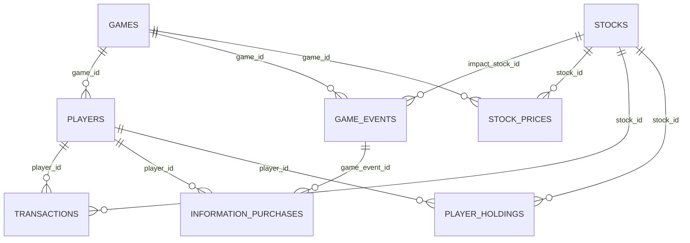

# DB 스키마 및 관계

주식 모의투자 게임의 `public` 스키마입니다.  
기준: Supabase API 메타데이터 조회 (`2026-09-17`).

> 관계는 `*_id` 컬럼명을 기준으로 정리했습니다. API 메타데이터만으로 실제 FK 제약의 존재·삭제 규칙은 확인할 수 없습니다.

## 관계 요약

| 부모 | 자식 | 의미 |
|---|---|---|
| `games` | `players`, `game_events`, `stock_prices` | 게임별 참여자·이벤트·시세 |
| `players` | `transactions`, `information_purchases`, `player_holdings` | 플레이어의 거래·정보 구매·보유 수량 |
| `stocks` | `game_events`, `stock_prices`, `transactions`, `player_holdings` | 종목별 이벤트 영향·시세·거래·보유 |
| `game_events` | `information_purchases` | 이벤트 정보 구매 이력 |

## 테이블

### games — 게임 세션

| 컬럼 | 타입 | 설명 |
|---|---|---|
| `game_id` | bigint | PK |
| `invite_code` | varchar | 초대 코드 |
| `game_days` | integer | 진행 일수 |
| `reset_minutes` | integer | 리셋 주기(분) |
| `status` | varchar | 기본값 `OPEN` |
| `started_at`, `ended_at` | timestamptz | 시작·종료 시각 |
| `current_day` | integer | 기본값 `1` |
| `created_at` | timestamptz | 기본값 `now()` |

### players — 게임 참여자

| 컬럼 | 타입 | 설명 |
|---|---|---|
| `player_id` | bigint | PK |
| `game_id` | bigint | → `games.game_id` |
| `player_name` | varchar | 이름 |
| `cash` | numeric | 기본값 `1000000` |
| `created_at` | timestamptz | 기본값 `now()` |

### stocks — 종목 마스터

| 컬럼 | 타입 | 설명 |
|---|---|---|
| `stock_id` | bigint | PK |
| `stock_name` | varchar | 종목명 |
| `ticker` | varchar | 티커 |
| `sector` | varchar | 섹터 |
| `initial_price` | numeric | 초기 가격 |

### stock_prices — 게임별 일자 시세

| 컬럼 | 타입 | 설명 |
|---|---|---|
| `price_id` | bigint | PK |
| `game_id` | bigint | → `games.game_id` |
| `stock_id` | bigint | → `stocks.stock_id` |
| `market_day` | integer | 게임 내 일자 |
| `price` | numeric | 가격 |
| `change_rate` | numeric | 등락률 |

### game_events — 시장 이벤트

| 컬럼 | 타입 | 설명 |
|---|---|---|
| `game_event_id` | bigint | PK |
| `game_id` | bigint | → `games.game_id` |
| `market_day` | integer | 발생 일자 |
| `event_type` | varchar | 이벤트 유형 |
| `title`, `content` | varchar, text | 제목·공개 내용 |
| `private_content` | text | 비공개 내용 |
| `info_price` | numeric | 기본값 `10000` |
| `impact_stock_id` | bigint | → `stocks.stock_id` (선택) |
| `impact_rate` | numeric | 기본값 `0` |

### transactions — 거래 이력

| 컬럼 | 타입 | 설명 |
|---|---|---|
| `transaction_id` | bigint | PK |