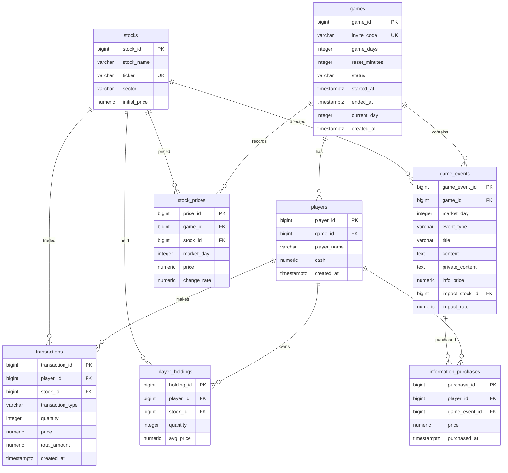
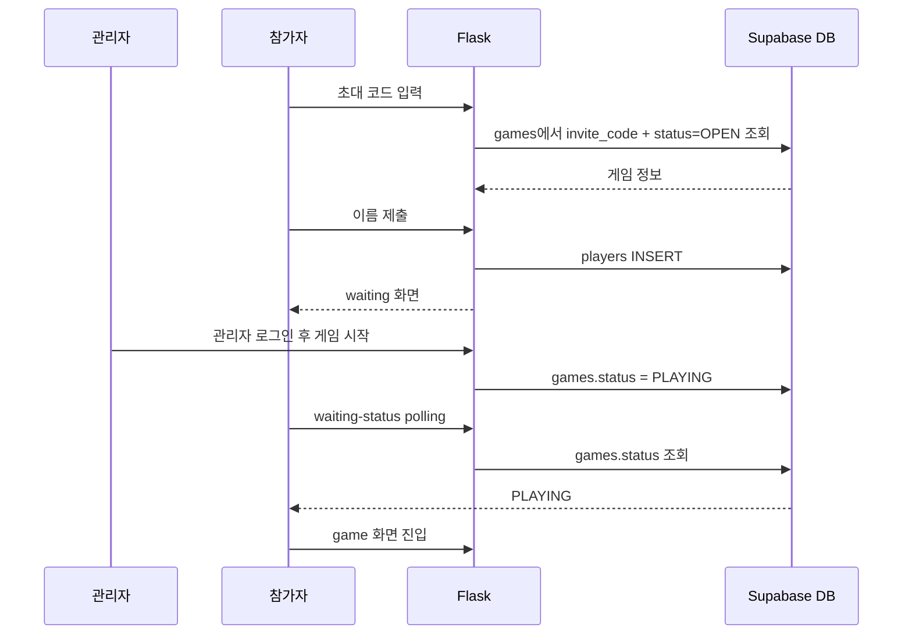

# JUSEE Stock Simulator DB

## 1. 전체 관계



## 2. 테이블 설명

### `games`

게임 한 판의 설정과 진행 상태를 저장하는 부모 테이블입니다.

| 컬럼 | 타입 | 설명 |
| --- | --- | --- |
| `game_id` | bigint | PK, 자동 증가 |
| `invite_code` | varchar(20) | 참가 코드, UNIQUE |
| `game_days` | integer | 게임 기간, `10`, `20`, `30` 중 하나 |
| `reset_minutes` | integer | 시세 변동 주기, `1`, `5`, `10`, `1440` 중 하나 |
| `status` | varchar(20) | `OPEN`, `PLAYING`, `FINISHED` |
| `started_at` / `ended_at` | timestamptz | 시작/종료 시각 |
| `current_day` | integer | 현재 게임 일자, 기본값 `1` |
| `created_at` | timestamptz | 생성 시각, 기본값 `now()` |

### `players`

게임에 참가한 플레이어입니다. `games 1 : N players` 관계입니다.

| 컬럼 | 타입 | 설명 |
| --- | --- | --- |
| `player_id` | bigint | PK, 자동 증가 |
| `game_id` | bigint | FK -> `games.game_id` |
| `player_name` | varchar(30) | 플레이어 이름 |
| `cash` | numeric(15,2) | 보유 현금, 기본값 `1000000` |
| `created_at` | timestamptz | 참가 시각 |

### `stocks`

게임에서 거래할 종목의 기준 정보입니다. 여러 게임에서 재사용할 수 있습니다.

| 컬럼 | 타입 | 설명 |
| --- | --- | --- |
| `stock_id` | bigint | PK, 자동 증가 |
| `stock_name` | varchar(50) | 종목명 |
| `ticker` | varchar(20) | 티커, UNIQUE |
| `sector` | varchar(50) | 업종 |
| `initial_price` | numeric(12,2) | 초기 가격 |

### `stock_prices`

게임별, 종목별, 시장일별 가격 스냅샷입니다. `games`와 `stocks`를 연결하는 이력 테이블입니다.

- FK: `game_id` -> `games.game_id`
- FK: `stock_id` -> `stocks.stock_id`
- UNIQUE: (`game_id`, `stock_id`, `market_day`)

### `transactions`

플레이어의 매수·매도 기록입니다.

- FK: `player_id` -> `players.player_id`
- FK: `stock_id` -> `stocks.stock_id`
- `transaction_type`는 `BUY` 또는 `SELL`
- `total_amount`는 거래 수량과 거래 가격을 반영한 총액

### `player_holdings`

플레이어의 현재 종목 보유량을 저장합니다.

- FK: `player_id` -> `players.player_id`
- FK: `stock_id` -> `stocks.stock_id`
- UNIQUE: (`player_id`, `stock_id`)
- `quantity`: 현재 보유 수량
- `avg_price`: 평균 매수가

### `game_events`

게임 중 발생하는 일반 뉴스 또는 큰 이벤트입니다.

- FK: `game_id` -> `games.game_id`
- FK: `impact_stock_id` -> `stocks.stock_id`, 영향 종목이 없으면 NULL 가능
- `event_type`는 `NORMAL` 또는 `BIG`
- `private_content`는 정보 구매 전 공개하지 않는 내용
- `impact_rate`는 영향 종목의 변동률

### `information_purchases`

플레이어가 이벤트의 비공개 정보를 구매한 기록입니다.

- FK: `player_id` -> `players.player_id`
- FK: `game_event_id` -> `game_events.game_event_id`
- UNIQUE: (`player_id`, `game_event_id`)
- 같은 플레이어가 같은 이벤트 정보를 중복 구매할 수 없습니다.

## 3. FK 삭제 규칙

현재 FK는 모두 `ON DELETE CASCADE`입니다.

- 게임 삭제 -> 해당 게임의 플레이어, 이벤트, 가격 기록 삭제
- 플레이어 삭제 -> 거래, 보유 종목, 정보 구매 기록 삭제
- 종목 삭제 -> 거래, 보유 종목, 가격 기록, 해당 종목에 영향을 주는 이벤트 삭제
- 이벤트 삭제 -> 해당 이벤트의 정보 구매 기록 삭제

운영 중인 게임을 삭제하면 관련 이력이 함께 삭제되므로, 일반적으로는 삭제 대신 `status = 'FINISHED'`를 사용하는 편이 안전합니다.

## 4. 현재 Flask 코드와 DB 사용 현황

현재 `app.py`에서 실제로 사용하는 테이블은 다음 두 개입니다.

1. `games`
   - 초대 코드로 `OPEN` 게임 조회
   - 관리자 시작 시 `status`를 `PLAYING`으로 변경
   - 대기실에서 게임 상태 확인
2. `players`
   - 참가자 등록
   - 관리자 화면에서 게임별 참가자 조회

아직 Flask 라우트에 연결되지 않은 테이블은 `stocks`, `stock_prices`, `transactions`, `player_holdings`, `game_events`, `information_purchases`입니다. 따라서 현재 화면은 참가와 게임 시작까지의 흐름만 동작하고, 시세 조회·매수·매도·이벤트·정보 구매 기능은 별도 API와 화면 구현이 필요합니다.

## 5. 현재 사용자 흐름



## 6. 구현 시 주의점

- `players.game_id`는 반드시 참가하려는 `games.game_id`를 참조해야 합니다.
- 게임 참가 시 `status = OPEN`인지 확인하고, 시작 이후에는 참가를 막아야 합니다.
- 거래 처리 시 `transactions`, `players.cash`, `player_holdings`를 한 작업으로 갱신해야 데이터 불일치를 줄일 수 있습니다.
- 가격 조회 시 `stock_prices`의 `game_id`, `stock_id`, `market_day` 세 조건을 함께 사용해야 합니다.
- 관리자 게임 생성 기능은 현재 Flask 코드에 없으므로, `games` 행은 Supabase에서 직접 생성하거나 생성 라우트를 추가해야 합니다.

## 7. 애플리케이션 전체 구조

Flask가 HTML과 Supabase 사이의 중간 계층 역할을 합니다.

```text
HTML
	↓
Flask
	↓
Supabase
```

```text
										┌──────────────┐
										│   Supabase   │
										│ games        │
										│ players      │
										│ stocks       │
										│ game_events  │
										│ holdings     │
										└──────┬───────┘
													 │
													 ▼
┌──────────────────────────────────────────────┐
│                    Flask                     │
│                                              │
│ 관리자:  /admin-login -> /admin              │
│ 플레이어: / -> /waiting -> /game             │
└──────────────────────────────────────────────┘
```

## 8. 관리자 흐름

관리자는 `/admin-login`에서 로그인합니다.

```text
/admin-login
		↓ 비밀번호 확인
session["admin"] = True
		↓
/admin
		↓ 게임 확인 및 시작
POST /start-game/<game_id>
```

게임 시작 시 `games.status`가 다음과 같이 변경됩니다.

```text
OPEN -> PLAYING
```

현재 관리자 화면에서 가능한 작업은 게임 확인, 참가자 확인, 게임 시작입니다. 게임 생성과 게임 진행 자동화는 아직 별도 구현이 필요합니다.

## 9. 플레이어 흐름

```text
/
	↓ 초대코드 입력
games에서 invite_code + status=OPEN 조회
	↓
join.html에서 이름 입력
	↓ POST /join-game
players INSERT
	↓
session["player_id"], session["game_id"] 저장
	↓
/waiting
	↓ /waiting-status polling
games.status == PLAYING
	↓
/game
```

참가자는 `games.status = OPEN`인 게임에만 등록할 수 있습니다. 세션에는 현재 참가자의 `player_id`와 참가 게임의 `game_id`가 저장됩니다.

## 10. `game.html` 목표 화면

`game.html`은 게임이 시작된 뒤 플레이어가 실제로 투자하는 화면입니다.

```text
┌─────────────────────────────────────┐
│          INVESTMENT GAME             │
│                                     │
│ DAY 1                 현재 시각     │
├─────────────────────────────────────┤
│ 오늘의 뉴스                         │
│ "업계 관계자에 따르면..."           │
├─────────────────────────────────────┤
│ 종목          가격          등락률   │
│ 한빛전자      72,300        +3.2%   │
│ 모터웍스     201,000        -1.1%   │
├──────────────────┬──────────────────┤
│ 주식 목록         │ 거래             │
│                  │ 수량             │
│                  │ [매수] [매도]    │
├──────────────────┴──────────────────┤
│ 현금       1,000,000원              │
│ 주식 평가액       0원               │
│ 총자산     1,000,000원              │
│ 수익률           0%                 │
└─────────────────────────────────────┘
```

총자산은 다음처럼 계산합니다.

```text
총자산 = players.cash + 주식 평가액
주식 평가액 = SUM(player_holdings.quantity * 현재 주가)
```

## 11. 게임 시간과 가격 변동

게임 시간은 `games.current_day`와 `stock_prices.market_day`를 기준으로 관리하는 것을 권장합니다.

```text
게임 시작
	↓
시장일 1
	↓ 뉴스 공개
가격 변동
	↓
시장일 2
	↓ 뉴스 공개
가격 변동
	↓
게임 종료 및 랭킹 계산
```

가격 변동은 매번 큰 폭으로 바뀌는 방식이 아니라 일반 변동과 이벤트 변동을 섞습니다.

```text
일반 변동       +1.2%
일반 변동       -2.1%
일반 변동       +0.8%
큰 이벤트      +12.5%
일반 변동       -1.7%
대형 이벤트     -35.0%
```

이벤트의 종류와 영향 대상은 `game_events`에 저장하고, 실제 시장일별 가격은 `stock_prices`에 기록합니다.

## 12. 뉴스와 빅 이벤트

뉴스는 가격 변동보다 먼저 공개하는 구조가 적합합니다.

```text
뉴스 공개
	↓
플레이어가 정보 확인 및 매매 판단
	↓
다음 시장일 가격 반영
```

`game_events.event_type`은 현재 `NORMAL`과 `BIG`을 지원합니다. 빅 이벤트는 게임 초반에 과도하게 발생하지 않도록 게임 진행률을 기준으로 확률을 조절할 수 있습니다.

예시:

```text
DAY 1  일반
DAY 2  일반
DAY 3  일반
DAY 4  일반
DAY 5  BIG EVENT 가능
DAY 6  일반
DAY 7  BIG EVENT 가능
DAY 8  최종 이벤트 가능
```

특정 종목의 급락이나 상장폐지 같은 파산 이벤트를 구현할 때는 `game_events`, `stock_prices`, `player_holdings`를 함께 갱신해야 합니다.

## 13. 매수·매도 처리

### 매수

1. 플레이어의 현금이 거래 금액 이상인지 확인합니다.
2. `players.cash`에서 거래 금액을 차감합니다.
3. `player_holdings`의 수량과 평균 매수가를 갱신합니다.
4. `transactions`에 `BUY` 기록을 추가합니다.

### 매도

1. 플레이어가 충분한 수량을 보유했는지 확인합니다.
2. `player_holdings.quantity`를 차감합니다.
3. `players.cash`에 매도 금액을 더합니다.
4. `transactions`에 `SELL` 기록을 추가합니다.

현금, 보유량, 거래 기록은 한 번의 처리 단위로 갱신해야 중간 실패로 인한 데이터 불일치를 줄일 수 있습니다.

## 14. 게임 종료

게임 시간이 끝나면 게임 상태를 변경하고 모든 플레이어의 총자산을 계산합니다.

```text
PLAYING
	↓ 게임 시간 종료
FINISHED
	↓
플레이어별 총자산 계산
	↓
랭킹 표시
```

예시:

```text
재혁    1,420,000원
철수    1,180,000원
영희      920,000원
```

## 15. 개발 순서

현재는 게임 참가와 시작까지 연결된 상태이며, 다음 순서로 확장합니다.

```text
✅ Flask 실행
✅ Supabase 연결
✅ 관리자/플레이어 구분
✅ 관리자 로그인
✅ 게임 초대코드 확인
✅ 플레이어 참가 및 players 저장
✅ Session 저장
✅ 대기실 상태 확인
✅ 관리자 게임 시작
✅ 기본 game.html 진입
⬜ game.html 실제 UI 구성
⬜ stocks와 stock_prices 조회
⬜ 종목 선택
⬜ 임시 매수/매도 동작
⬜ transactions와 holdings 연결
⬜ 게임 시간 엔진
⬜ 뉴스와 가격 변동 엔진
⬜ 빅 이벤트와 파산 이벤트
⬜ 게임 종료
⬜ 플레이어 랭킹
```

권장 구현 순서는 다음과 같습니다.

1. `game.html` 화면 구성
2. 임시 데이터로 매수·매도 UI 구현
3. `stocks`, `stock_prices` 조회 연결
4. `transactions`, `player_holdings`, `players.cash` 갱신 연결
5. 게임 시간·뉴스·가격 변동 엔진 구현
6. 게임 종료와 랭킹 구현
